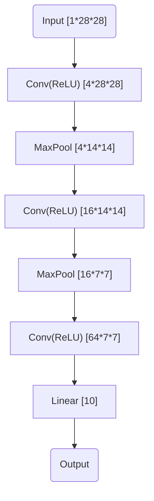

# P1 Digit Recognition

**Name**: 赵子涵
**Major**: Computer Science
**Student ID**: 2023E8013282148

### Dataset

The MNIST consist 60000 28*28 grayscale images for train set, and 10000 for test set. The images are all handwritten digits, and lable ranges from 0 to 9.

### Model Design

We implemented a CNN for this task. Specifically, the CNN we build consist three basic components, the convolution layer, the poolling layer, and the linear layer. Here is a diagram of our network

We choose maxpool as our pooling layer, and ReLU as our activation function. 

### Model Evaluation

We trained our model with batch_size=100, learning_rate=0.001 and epoch=5. We plot the loss and test accuracy as follows.

As shown above, the training loss decline rapidly, and the test accuracy reached 99%.